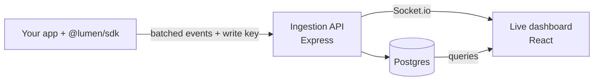

<div align="center">

# Lumen

### Product analytics your whole team can understand in five minutes.

Track events with one line of code. Watch them arrive live. See funnels, retention and trends without writing SQL.

[](https://github.com/sanjaykrishnan-Tech/Lumen/actions/workflows/ci.yml)


</div>

---

## Why Lumen?

Big analytics tools are powerful. They are also slow to set up, hard to learn and expensive to run. Most small teams use 10% of the features.

Lumen does the 10% that matters, and does it well.

| You want to know...                  | Lumen shows you...                        |
| ------------------------------------ | ----------------------------------------- |
| What is happening right now?         | A **live event feed** that updates in real time |
| Where do users drop off?             | **Funnels** with step-by-step conversion  |
| Do users come back?                  | **Retention cohorts** in a clear grid     |
| What is trending?                    | **Charts and insights** on the overview   |
| Did my tracking code work?           | A **test event** button in project settings |

## Features

- **Real-time event stream.** Events appear in the dashboard as they happen. Pause, filter and search the feed. Export to CSV.
- **Funnels.** Build an ordered list of steps. See how many users reach each one.
- **Retention.** Cohort grid that shows how many users return over time.
- **Overview.** Time-series charts, event breakdowns and top lists, with an insights strip that points out what changed.
- **Multiple projects.** One account, many apps. Each project has its own write key and its own data.
- **Shareable views.** Every filter lives in the URL. Copy the link and your teammate sees the same view.
- **Tiny SDK.** About 4.5 KB. Batches events, retries on failure and keeps an offline queue so nothing is lost on reload.
- **Secure by default.** Cookie-based auth with httpOnly tokens and refresh rotation. Passwords hashed with Argon2. Ingestion requires a write key and is rate limited.
- **Fast dashboard.** Code splitting, lazy-loaded charts and compressed responses.

## Pricing

Use the hosted version, or run it yourself for free. Same code either way.

| | **Free** | **Pro** |
| --- | --- | --- |
| Price | $0 | $9 / month |
| Events per month | 10,000 | 100,000 |
| Projects | 1 | 5 |
| History | 30 days | 6 months |
| Live feed, funnels, retention | ✓ | ✓ |
| CSV export | ✓ | ✓ |

Need more volume? [Open an issue](https://github.com/sanjaykrishnan-Tech/Lumen/issues) and tell us what you need.

**Self-hosting.** Billing is optional. Leave the `STRIPE_*` variables unset and the Stripe routes stay off. Plan limits still apply, and you can change them in `apps/backend/src/plans.ts`.

## Get started in 60 seconds

**1. Install the SDK**

```bash
yarn add @lumen/sdk
```

**2. Add two lines**

```ts
import { init, track } from '@lumen/sdk'

init({ apiUrl: 'https://your-lumen-api.com', writeKey: 'lmn_…' })
track('signed_up', { plan: 'pro' })
```

**3. Open the dashboard.** Your event is already there.

No bundler? Use a plain script tag. The IIFE build adds a global `Lumen` object with the same `init`, `track` and `flush` functions.

```html
<script src="/lumen.global.js"></script>
<script>
  Lumen.init({ apiUrl: 'https://your-lumen-api.com', writeKey: 'lmn_…' })
  Lumen.track('page_view', { page: location.pathname })
</script>
```

## How it works



## Under the hood

| Layer      | Tech                                              |
| ---------- | ------------------------------------------------- |
| Dashboard  | React 19, TypeScript, Tailwind, Recharts, Vite    |
| Backend    | Node, Express, Socket.io, Postgres                |
| SDK        | TypeScript, ESM + CJS + IIFE builds, via tsup     |
| Shared     | One types package used by dashboard and backend   |
| Quality    | Unit tests (Vitest), oxlint, GitHub Actions CI    |

```
apps/
  dashboard/       Analytics dashboard
  backend/         Ingestion API, auth, projects, real-time
  demo-app/        Sample task app that sends real events with the SDK
packages/
  sdk/             @lumen/sdk tracking library
  shared-types/    Types shared across apps
```

## Run it yourself

You need Docker (for Postgres) and the Node version in `.nvmrc`.

```bash
nvm use
yarn install
yarn build:sdk          # dashboard and demo-app need the built SDK

yarn db:up              # start Postgres
yarn db:migrate         # create the tables

yarn dev:backend        # http://localhost:4000
yarn dev:dashboard      # http://localhost:5173
yarn dev:demo           # http://localhost:5174
```

1. Open the dashboard and create an account.
2. Open the demo app and click around. Real events appear in the live feed.
3. Want a full dashboard right away? Run `yarn db:seed you@example.com` to add about 2,500 sample events.

### Configuration

Copy `apps/backend/.env.example` to `apps/backend/.env` and `apps/dashboard/.env.example` to `apps/dashboard/.env`.

| Variable          | Purpose                                                          |
| ----------------- | ---------------------------------------------------------------- |
| `DATABASE_URL`    | Postgres connection string. Works with hosted Postgres such as Neon. |
| `JWT_SECRET`      | Signs access tokens. **Required in production.**                 |
| `CORS_ORIGIN`     | Comma-separated list of allowed origins.                         |
| `COOKIE_SAMESITE` | Use `none` (with HTTPS) when dashboard and API use different domains. |
| `VITE_USE_MOCK`   | Set to `true` to run the dashboard on built-in mock data.        |
| `STRIPE_SECRET_KEY`, `STRIPE_PRO_PRICE_ID`, `STRIPE_WEBHOOK_SECRET`, `APP_URL` | Optional. Turn on paid plans through Stripe. |

## API reference

Auth uses httpOnly cookies: `POST /api/auth/register`, `login`, `refresh`, `logout`, and `GET /api/auth/me`.

| Endpoint                              | Auth        | What it does                        |
| ------------------------------------- | ----------- | ----------------------------------- |
| `GET /api/projects`                   | Signed in   | List your projects                  |
| `POST /api/projects`                  | Signed in   | Create a project                    |
| `POST /api/projects/:id/rotate-key`   | Signed in   | Issue a new write key               |
| `GET /api/events`                     | Project member | Query events (filter by type, text, date range) |
| `POST /api/events`                    | `X-Lumen-Key` header | Ingest up to 500 events. Returns `429` over the monthly quota |
| `GET /api/billing`                    | Signed in   | Plan, limits and this month's usage |
| `POST /api/billing/checkout`, `/portal` | Signed in | Start an upgrade, or manage billing in Stripe |

Ingest example:

```bash
curl -X POST https://your-lumen-api.com/api/events \
  -H "X-Lumen-Key: lmn_…" \
  -H "Content-Type: application/json" \
  -d '{"events":[{"eventType":"signed_up","userId":"u_42","properties":{"plan":"pro"}}]}'
```

## Roadmap

- [ ] Redis caching and event dedup
- [ ] Pre-computed rollups for large datasets
- [ ] Team invites and roles
- [ ] Alerts and weekly email digests
- [x] Hosted plans with Stripe billing
- [ ] Larger plans (after load testing)

Have a feature request? [Open an issue](https://github.com/sanjaykrishnan-Tech/Lumen/issues).

## License

[AGPL-3.0](LICENSE). You can use, modify and self-host Lumen freely. If you offer a modified version as a network service, you must share your changes under the same license.

## Contributing

CI runs lint, tests and builds on every pull request. Run the same checks locally before you push:

```bash
yarn workspace dashboard lint
yarn workspace dashboard test
yarn workspace backend build
yarn workspace dashboard build
```

---

<div align="center">

**Lumen.** Know your product. Skip the complexity.

</div>
